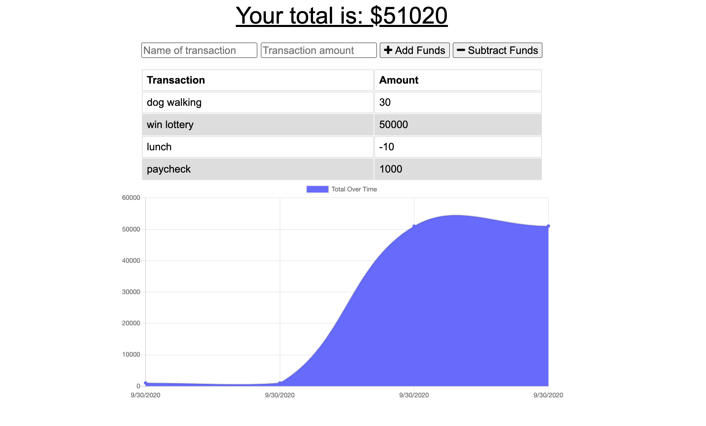

# Budget Tracker

# Description

This is a simple budget tracker which allows users to track their income and spending on a transaction-by-transaction basis, automatically calculating their remaining balance as new transactions are added.

# Table of Contents

- [Table of Contents](#table-of-contents)
- [Installation](#installation)
- [Usage](#usage)
- [License](#license)
- [Testing](#testing)

# Installation

Run an npm install to ensure all required modules are installed before usage.

# Usage

This application is designed to be simple and user-friendly.

Home page: 

This application is deployed on Heroku and can be visited here:

# License

No additional licenses are needed for this application.

# Testing

There is currently no testing set up for this application.

